# Tutorial

---

[Overview](index.md) | [Contribution](contribute.md) | [Troubleshoot](troubleshoot.md) | [Tutorial](tutorial.md)

---

This tutorial introduces the features of the DDDC Plugin by walking you through a manual upload of asset data in CSV, raw text, or JSON format. You will see how this data is processed in the different views and get to know the individual features along the way.

- `Device Findings`: Shown in this tutorial
- `Communication Findings`: Initial version described in the [manual, page 28](../d3c/documents/DDDC_User-manuel_V0.95.pdf#page=28)
- `Communication and Software attributes`: Initial version described in the [manual, page 34 ](../d3c/documents/DDDC_User-manuel_V0.95.pdf#page=34)

## Manual Upload

### Standard Import

NetBox provides a standard import function. With this function you can either enter raw data or upload a data file.

1. Click the highlighted import button on the d3c module in the left-hand menu.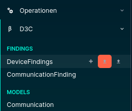

    - Paste the raw text from `data/rawdata.txt` and click **Validate**
        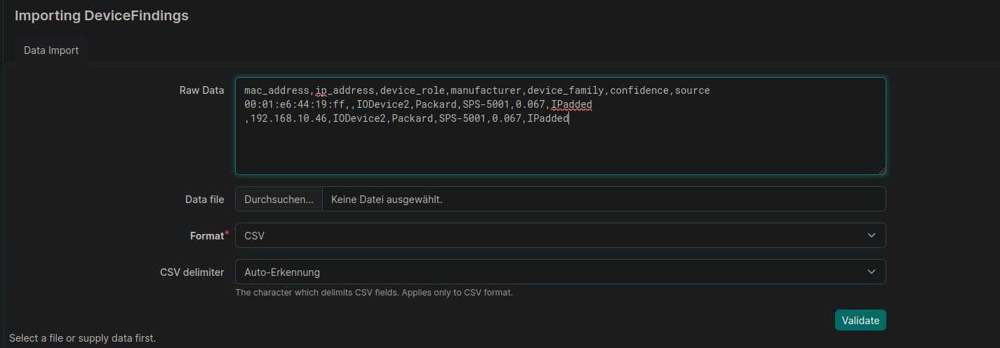  
    OR  
    - Upload a data file such as `input_sdt.csv`

Note that the standard import function works only if the data fields are known and listed in the table below.
Otherwise the import fails and an error message appears in the lower right-hand corner.
If the imported data is valid, you will see the device [Table View](#table-view).

### DDDC Function

1. Click the d3c plugin icon in the left-hand menu and select **Import/Mapping**
  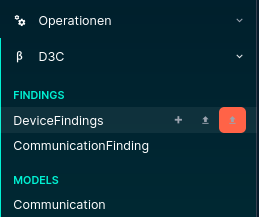

    - Paste the raw text from `data/rawdata.txt` and click **Validate**
  
      OR  
    - Upload a data file such as `input_sdt_dddc.csv`

2. **Check your data** in the template. The template controls how data is transferred from the source data to the Device Findings. After you click the **Validate** command button, the templates are applied to the first data row of the source data and the result is shown next to the template. You can address attributes

    - directly, by using {header}
    - by using regex. Examples of using regex are given at the bottom of this page.
  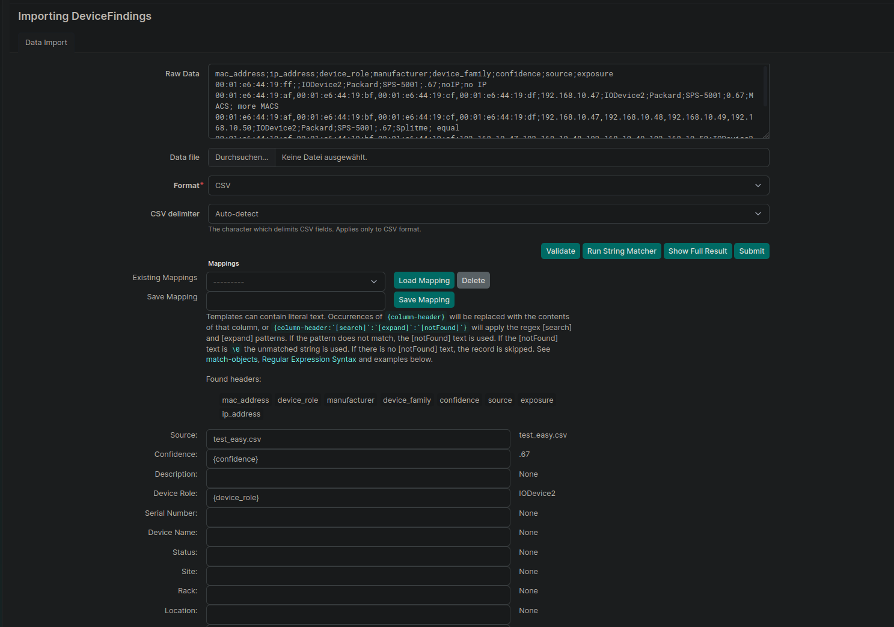

3. **Actions**  
After you have checked your data, you can use the following actions:
    - **Mapping options**: Save templates to save time when you process the same data structure of your input files again.
    - **`Validate`**: Applies the current mapping to the first row
        of data and shows the result next to the mappings.
        This does not change any data and is safe to execute.
    - **`Run String Matcher`** 
        : Processes your input data into the intended data fields.
        This is useful if you have structured text and want to improve the assignment when a column contains several data fields, for example when a full product name is given.
    - **`Show Full Result`**: Applies the defined mappings to the
        entire data file and shows the full result as a table below the mappings. This does not change any data
        and is safe to execute.
    - **`Submit`**: Submits the data and the mapping and generates
        Device Findings from them.

## Table View

This view presents all DeviceFindings in tabular form. You open the Table View by clicking `DeviceFindings` in the left-hand menu. The page is also opened automatically when you upload data manually ([see manual upload](#manual-upload)).

  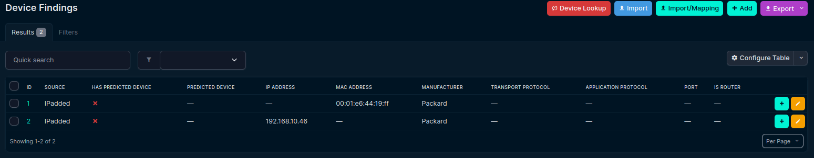

This view mainly serves to assign findings to devices in the NetBox device database.
In the top right corner there are five buttons, each of which is described below:

- **Device Lookup**: This button starts a lookup for all DeviceFindings displayed
in this table. Based on the IP and/or MAC addresses. If available, it searches for a device in the NetBox device database. Please note that this lookup is resource-intensive and may take some time to complete.
- **Import**: Opens the default Import view that every NetBox model provides.
- **Import/Mapping**: Opens the Import and Mapping view described in section Manual Upload → DDDC Function.
- **Add**: Opens the Add view described in section Manual Upload.
- **Export**: Provides the default export function for Table Views in NetBox.

**The first action** you should take when you open this view is to perform a `Device Lookup`.
Using the IP and/or MAC address information provided by each
DeviceFinding, the associated device inside NetBox is identified.

### Edit the Findings

You can **create a new device** in NetBox by clicking the + sign to the right of each finding. At the top the IP and MAC address are provided. You simply enter a name and the required name for the interface.

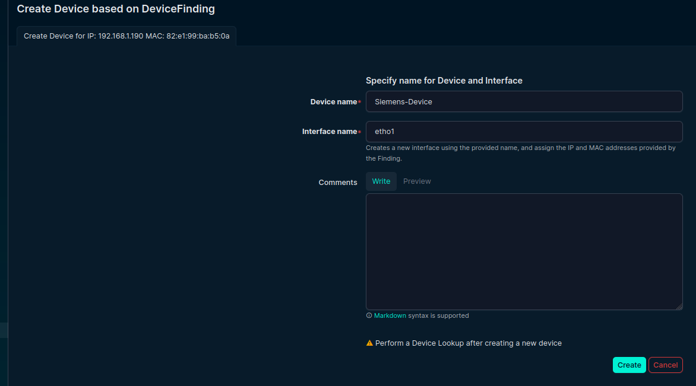

> :exclamation: Note the warning message at the bottom telling you to perform a Device Lookup afterwards.

If you notice that the **interface** of a device has to be adapted, or that a new interface has to be created from a DeviceFinding, use the Table View.
For example, you may notice that the device with the IP address 192.168.10.46 also belongs to 'Siemens-Device', but that the IP address belongs to a missing interface.
In this case you can click the yellow button to the right of the row.
In the new view you can edit the IP and/or MAC address of the DeviceFinding.
Moreover, you can select the device associated with the DeviceFinding and enter the interface name for the new interface.
As shown in the figures below,
if the interface name does not exist, it is created and the respective IP and/or MAC address from the DeviceFinding is assigned to it. If the MAC address of the interface has not been set yet, it is updated; if it is already set, a new IP is generated and
then assigned to the interface. After you click the **Save** button, the interface is created and you are returned to the Table View. 

You must perform a Device Lookup before the changes to the 'Predicted Devices' attribute can be seen.

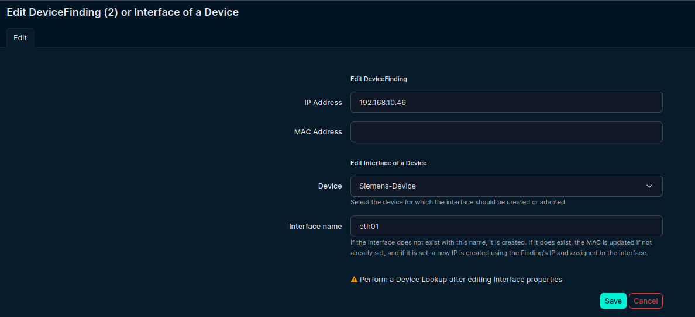

The DDDC plugin supports only single values for an IP or MAC address. However, since new use cases involve multiple IP and MAC addresses, this view provides a **Split Selected** button.\
This feature assumes that the first item in the IP address list and the first item in the MAC address list logically belong to
the same interface, followed by the second item of the IP list and the second item of the MAC list, and so forth.  
Clicking the **Split** button clones the corresponding finding
according to the length of the IP/MAC lists.  
The previous finding is rejected automatically if the creation was successful. You can test this with the sample files `data/test_easy.csv` and `data/test_multi.csv`.

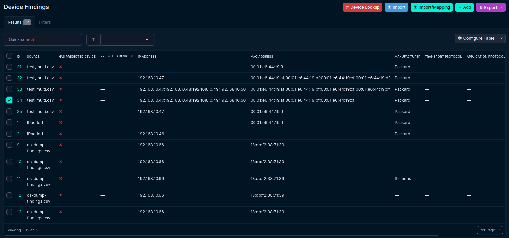

For test_multi.csv only ID 33 will work, because the number of IP and MAC addresses is equal. The result will look as follows

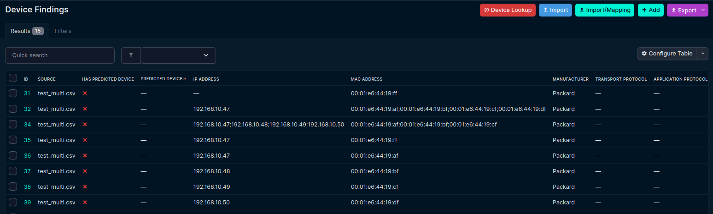

### Mapping

If a device is found for a DeviceFinding, a green checkmark is displayed under 'Has predicted device',
and the specific device name is shown under 'Predicted Device'.

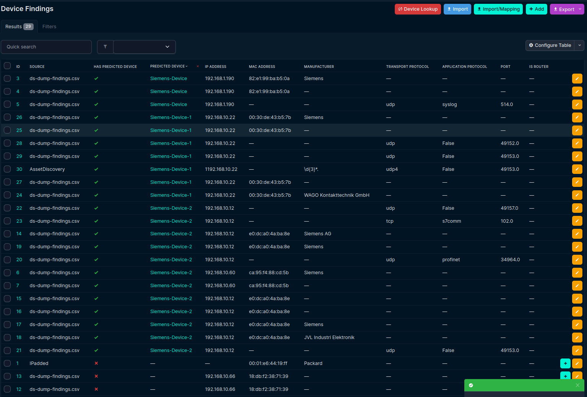

You still have the opportunity to check whether this mapping is correct. If it is correct, you can map the finding to the device by selecting it via the checkbox at the beginning of the row
and clicking the **Map Selected to Device** button at the bottom.
Afterwards the mapped DeviceFindings are no longer displayed in the Table View, and you can process them further directly in the
[Apply DeviceFindings on a Device](#apply-devicefindings-on-a-device) section of the Device View.

### Adjust Table

You can adjust the table by clicking "configuration table" in the right corner at the top of the table.

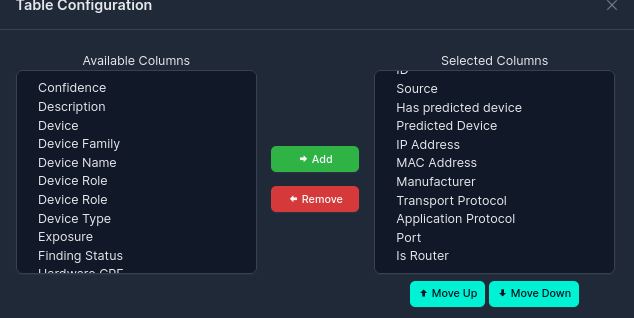

### Filter Findings

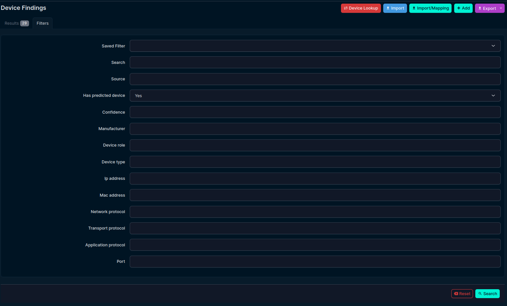

If all predictions are correct, simply type 'True' into the 'Quick search' text box and select all findings by clicking the checkbox in the header.
Furthermore, you can use the filters (at the top left next to the tab "Results"). Afterwards you can save this filter by clicking the "Save" button at the top left.

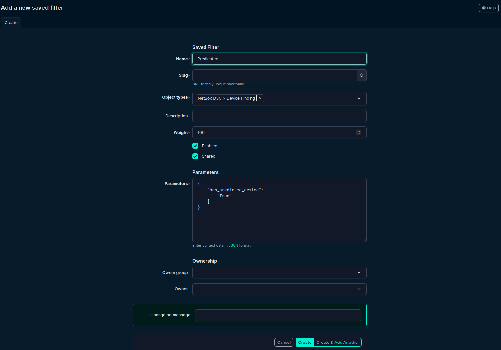

This creates a filter in the NetBox core. After you confirm with the "Create" button at the bottom, the filter is available in the filter mask of Device Findings.

---
---

## Apply DeviceFindings on a Device

After you have applied the findings to a device, you can finally map them. The reason for this multiple-step process is that you receive and map the raw data in the d3c plugin before mapping and adapting it into a normalized dataset. In the developer case several enrichment methods were used on network data, which is why a pre-selection of those findings was necessary. In the case of an asset database with clear headers and reliable input, this process may be unnecessary.

Open the device view from the menu on the left-hand side and select any device

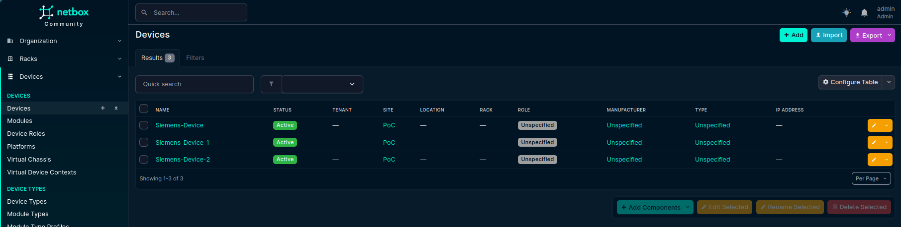

The Findings tab at the top shows three new findings.

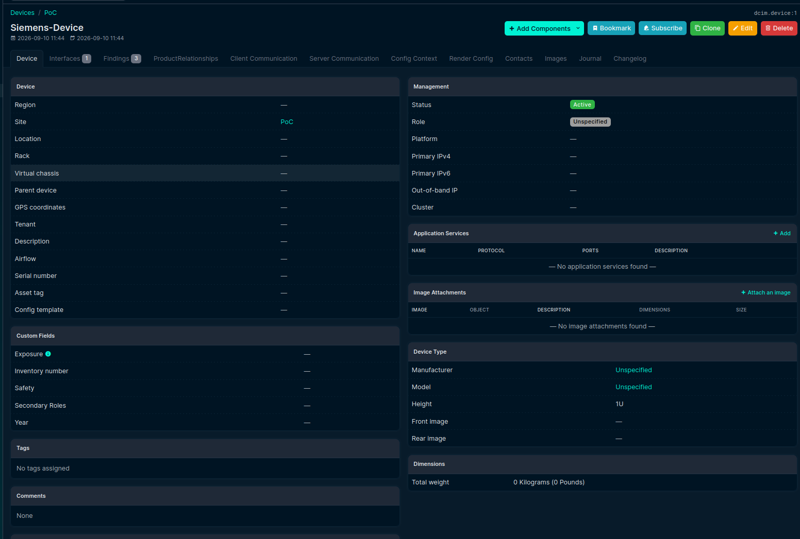

By selecting it, you see the findings and the current value of each attribute at the bottom.\
Using the buttons at the top of the table, you can select whether all, new, or done findings shall be shown.
In order to work with the findings, select those to be used via the radio buttons next to them. When you use **Apply Selected to Device**, all findings that are selected via the ID columns (all by default) are applied.  
Alternatively, you can use the **Apply DeviceFinding** button next to the edit button in the row.

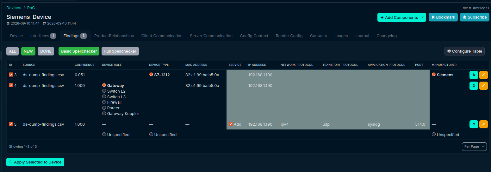

In this case a new service should be added, and you can apply it.

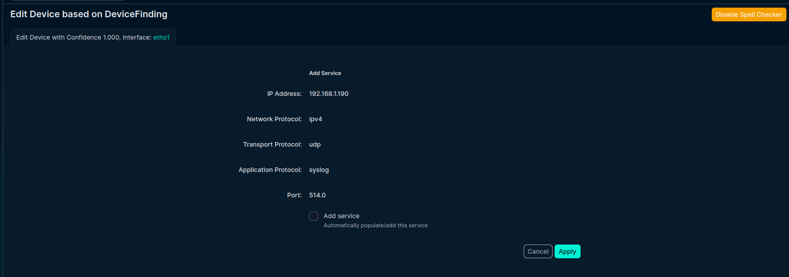

One important option is the spell checker. It ensures that the input is normalized. At the moment this feature is deactivated, because the underlying models are under reconstruction.
